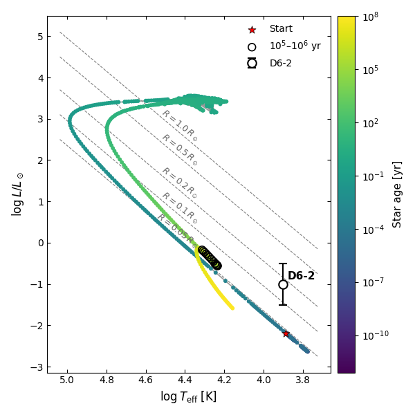

# AREPO–MESA Profile Tools

Tools for processing, visualizing, and converting stellar merger and impact remnant profiles between **AREPO** and **MESA** workflows.

## Overview

This repository contains scripts and workflows for modelling post-impact proto-white-dwarf remnants. The tools convert three-dimensional hydrodynamical simulation outputs from **AREPO** into one-dimensional stellar models that can be relaxed and evolved using **MESA**.

The primary goal is to predict the observable properties of post-impact stellar remnants by combining hydrodynamical simulations with long-term stellar evolution calculations.

## What this repository does

The repository is organised into two main components:

### 1. Input_files

This folder contains Python scripts that process AREPO simulation outputs and generate composition and entropy profiles suitable for use in MESA. These files are used to construct and relax one-dimensional stellar models.

### 2. MESA_files

This folder contains MESA inlists and configuration files used to relax the imported profiles and evolve the remnant to later evolutionary stages.

## Scientific Context

Hydrodynamical simulations can capture the complex physics of stellar impacts and merger events, while stellar evolution codes such as MESA are required to follow the long-term evolution of the resulting remnant.

This workflow bridges these two stages by mapping AREPO outputs into MESA-compatible structures and evolving them to predict observable properties.

## Technologies Used

* Python
* NumPy
* Matplotlib
* AREPO
* MESA
* Scientific data analysis
* Stellar evolution modelling

## Repository Structure

```text
.
├── Input_files/      # Process AREPO outputs and generate MESA inputs
├── MESA_files/       # MESA inlists and evolution files
├── figures/          # Output figures and visualizations
├── README.md
```

## Output

The figure with HR diagram with D6-2 



## Author

**Abinaya Swaruba Rajamuthukumar**

Postdoctoral Researcher
Max Planck Institute for Astrophysics

Computational Astrophysics • Scientific Computing • Stellar Evolution
